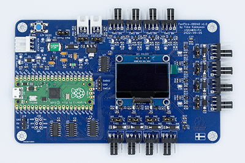
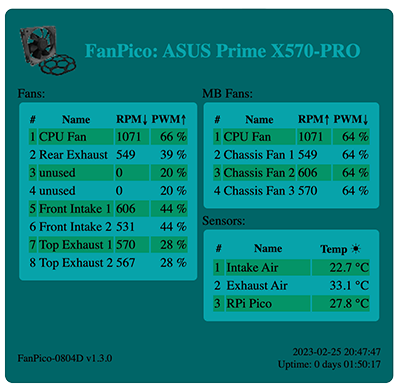
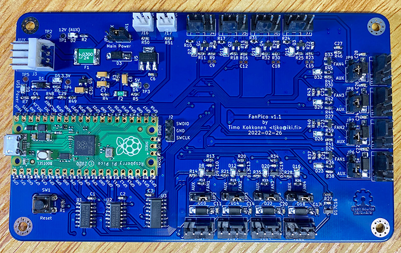
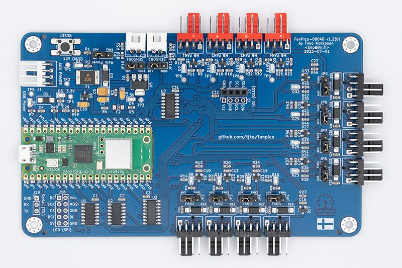
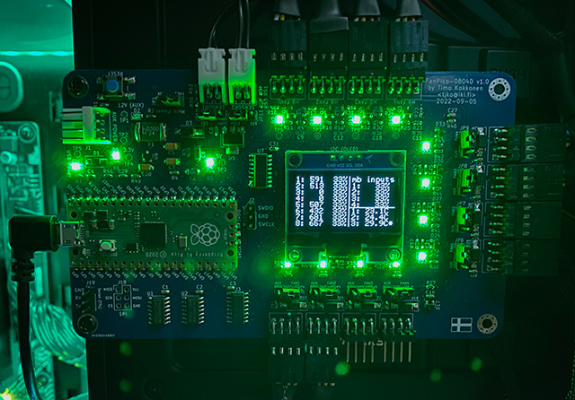
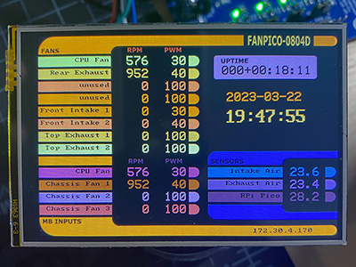

<a href="https://certification.oshwa.org/us002599.html" title="Open Source Hardware Association Certificate"></a>

# Fanpico: Smart PWM (PC) Fan Controller
[](https://github.com/tjko/fanpico/actions/workflows/cmake.yml)
[](https://github.com/tjko/fanpico/actions/workflows/codeql.yml)

Fanpico is a smart PWM (PC) fan controller based around [Raspberry Pi Pico](https://www.raspberrypi.com/documentation/microcontrollers/raspberry-pi-pico.html) (RP2040 MCU). Fanpico operates as standalone controller that can be configured and left running. It does not require any drivers and doesn't care what OS is being used. FanPico is an Open-source hardware (OSHW) project.

[](images/fanpico-0804D-large.jpg?raw=true)

## What is it for?
* Fanpico is for customizing fan "curves" to fine tune how your motherboard controlled fans run.
* Fine tuning fan speeds to easily balance airflow.
* Controlling fan based on temperature sensor input.
* Monitoring fan speeds and behaviour as well as monitoring what exactly motherboard is doing.
* Fanpico works also as standalong controller for other things than a PC, it's been used  controlling fans on 3D printers and on enclosed network equipment racks, etc..

## Features
* Controls up to 8 fans.
* Connect up to 4 motherboard fan outputs.
* Connect up to 2 remote temperature probes (plus onboard "ambient" temperature sensor).
* [OLED](https://github.com/tjko/fanpico/wiki/OLED-(I2C)-Display-Support) and [LCD](https://github.com/tjko/fanpico/wiki/LCD-(SPI)-Panel-Connection) display support (boards where model name ends with "D").
* Can be powered from motherboard fan outputs or using (AUX) 4-pin floppy connector.
* Ability to define custom fan "curves" for each fan.
* Ability to provide custom tachometer (fan RPM) output signal back to motherboard.
* Control fans from any motherboard PWM signal or from temperature sensors.
* OS Independent, no drivers or software needed.
* Configuration stored on the device itself (in the flash memory).
* SCPI "like" programming interface (see [Command Reference](commands.md))
* Monitor each fan and motherboard output signals as well as temperatures.
* [WiFi support](https://github.com/tjko/fanpico/wiki/FanPico-Web-Interface) if opting to mount Pico W on the board. This turns fanpico into small "IoT" device with basic web interface.
* [MQTT client](https://github.com/tjko/fanpico/wiki/FanPico-MQTT-Tutorial) with TLS support for logging data and to receive commands.
* Telnet server for configuration and monitoring.

### Interfaces

* Serial "Console". Primary method for configuring/monitoring FanPico units is via (USB) Serial console (some units also have 3.3V TTL Serial connection).
* Desktop application (that polls FanPico using SCPI commands over the console connection): [FanPico Monitor](https://github.com/tjko/fanpico-monitor)
* Web Interface (available when using _Pico W_) over WiFi

   [](images/fanpico-web.png?raw=true)

For more documentation check [FanPico Wiki](https://github.com/tjko/fanpico/wiki)

## Sponsors
I would like to thank following sponsors, who have helped FanPico project:

* PCBWay


## Where can I get one?
Currently Fanpico is available as a DIY project. 
Check discussion forums for places to purchase Kits or PCBs: [Places to Purchase FanPico](https://github.com/tjko/fanpico/discussions/12)

(Instructions for building the kit are in [FanPico Wiki](https://github.com/tjko/fanpico/wiki))

However, if there is sufficient interest, then ready-made units may be made available for sale.
If you'd be interested in purchasing FanPico pease indicate your interest here: [FanPico Forum](https://github.com/tjko/fanpico/discussions/9)

### DIY Option
You can upload the Kerber files (found under boards directory) to your favorite PCB maker website and get your boards produced in matter of days.
Component list (BOM or bill of materials) is found under boards directory as well along with the electrical schematics.

NOTE, check [discussions forum](https://github.com/tjko/fanpico/discussions/) for giveaways for free PCBs.

### Review Units
If you are member of press (or YouTuber) and would like to review/test Fanpico. Please contact me via email.


## How Can I help?
* Build your own FanPico and provide feedback, suggestions (see discussion forums).
* If you're into electronics new/improved board designs are most welcome.
* If you're into programming:
  - Create cool (desktop) program that allows easily configuring FanPico boards (with ability to "draw" fan curves, etc..) and to monitor Fan statuses.
  - Help improve the firmware.
* If you're into graphics (or web) design:
  - Help create cool (but lightweight) web interface
  - Create better logo for FanPico
* As this is Open (Source) Hardware Project, if you like to build (and sell) assembled boards or DIY kits, you'd be most welcome...
* You can always donate (and get your name added to the Sponsors section, if you so wish).


## Hardware
Fanpico is Open Source Hardware, reference design is provided for the "0804" model (8 fan outputs and 4 motherboard fan inputs), and "0804D" model that adds OLED display support (hence the "D" suffix).


Additional models with different combinations of fan inputs/outputs could be easily designed (takining into account limitations of Raspberry Pi Pico I/O limits). New and improved PCB models/designs are most welcome.

Model "0804" without display (with straight connectors):



Model "0840D" with (with right-angle connectors):

[](images/fanpico-0804D-v1.2b-large.jpg?raw=true)


### Hardware Design
Fanpico (reference design) utilizes all available I/O pins on a Raspberry Pi Pico.
* Fan PWM outputs are driven by the Pico's PWM hardware.
* Motherboard Fan PWM inputs are read using Pico's PWM hardware.
* Tacho signal output (for motherboard connectors) is generated using Pico's PIO hardware, providing extremely stable tachometer signal.
* Tacho signal inputs (from fans) are read differently in model 0804 and 0804D:
  - 0804: signals are read using GPIO interrupts, measuring all fans simultaneously by counting number of pulses received over a period of time.
  - 0804D: signals are read through multiplexer measuring one fan at a time, by measuring pulse length.
* Temperature readings are done using ADC, with help of a accurrate 3V voltage reference (LM4040). Any NTC (10k or 100k) thermistors can be used as themperature sensors.
* Each FAN output has jumper to select whether fan gets its power from associated MBFAN connector or from the AUX connector
* There is a jumper to select whether power the Fanpico itself from MBFAN1 or AUX connector.

To help design and test Fanpico couple other projects were born:
* [Tiny PicoProbe](https://github.com/tjko/tiny-picoprobe/) - tiny PicoProbe implementation.
* [Fan Test Adapter](https://github.com/tjko/fan-test-adapter/) - adapter to help simulate motherboard fan outputs.

Projects based on FanPico firmware:
* [BrickPico](https://github.com/tjko/brickpico/) - (LEGO) LED Light Kit Controller.

### Models (PCB designs)
Currently following models are available:

|Model|Fans (Outputs)|MB Fan (Inputs)|External Temperature Sensors|Display|Notes|
|-----|--------------|---------------|-------------------|--------|-----|
|[FANPICO-0804](boards/fanpico-0804/)|8|4|2|N|First publicly available board (reference design).|
|[FANPICO-0804D](boards/fanpico-0804D/)|8|4|2|Y|Support for OLED (128x64) displays. PCB Under development.|

(all boards have one additional 'on-board' temperature sensor on the RP2040 MCU itself)

Models ending with "D" support a display to see 'real-time' status of fans and temperatures.

OLED panel directly mounted on the PCB:



LCD Panel attached via a short cable:



## Firmware
Firmware is developed in C using the Pico SDK. Pre-compiled firmware is released when there is new major features or bug fixes.

Latest pre-compiled firmware image can be found here: [Releases](https://github.com/tjko/fanpico/releases)

To get latest firmware with latest updates/fixes you must compile the firmware from the sources.


### Installing firmware image
Firmware can be installed via the built-in UF2 bootloader on the Raspberry Pi Pico or using the debug header with Picoprobe, etc...

#### Selecting Right Firmware to use
Each release (zip file) contains multiple different firmware files.
Make sure to select firmware for the board you're using and for the pico model ("pico_w" if using Pico W).

Firmware file names have format: fanpico-<board_model>-<pico_model>.uf2
```
fanpico-0804-pico.uf2
fanpico-0804-pico_w.uf2
fanpico-0804D-pico.uf2
fanpico-0804D-pico_w.uf2
```

#### Upgrading Firmware
Firmware upgrade steps:
* Boot Pico into UF2 bootloader. This can be done in two ways:
  1)  Press and hold "bootsel" button and then press and release "reset" button.
  2)  Issue command: SYS:UPGRADE
* Copy firmware file to the USB mass storage device that appears.
* As soon as firmware copy is complete, Pico will reboot and run the fanpico firmware.

### Building Firmware Images

Raspberry Pi Pico C/C++ SDK is required for compiling the firmware:

#### Requirements / Dependencies
* [Raspberry Pi Pico C/C++ SDK](https://www.raspberrypi.com/documentation/microcontrollers/c_sdk.html)
* [cJSON](https://github.com/DaveGamble/cJSON)
* [pico-lfs](https://github.com/tjko/pico-lfs)
* [ss_oled-lib](https://github.com/tjko/ss_oled-lib)
* [bb_spi_lcd-lib](https://github.com/tjko/bb_spi_lcd-lib)
* [libb64](https://github.com/libb64/libb64)
* [pico-telnetd](https://github.com/tjko/pico-telnetd)

##### Install Pico SDK
Pico SDK must be installed working before you can compile fanpico.

Instructions on installing Pico SDK see: [Getting started with Raspberry Pi Pico](https://datasheets.raspberrypi.com/pico/getting-started-with-pico.pdf)

(Make sure PICO_SDK_PATH environment variable is set)

##### Downloading sources

Create some directory for building fanpico ('src' used in this example):
```
$ mkdir src
$ cd src
$ git clone https://github.com/tjko/fanpico.git
$ git submodule update --init --recursive
```

##### Building fanpico firmware

To build fanpico firmware, first create a build directory:
```
$ cd fanpico
$ mkdir build
```

Select which board to build firmware for (default is "0804") and which Pico is to be used (default is "pico"):
```
$ cd build
$ cmake -DFANPICO_BOARD=0804D -DPICO_BOARD=pico_w ..
```

Then compile fanpico:
```
$ make -j
```

After successful compile you should see firmware binary in the build directory:
subdirectory:

```
$ ls *.uf2
fanpico.uf2
```

If you have picotool installed you can check the firmware image information:
```
$ picotool info -a fanpico.uf2
File fanpico.uf2:

Program Information
 name:          fanpico
 version:       1.4.0 (Mar 24 2023)
 web site:      https://github.com/tjko/fanpico/
 description:   FanPico-0804D - Smart PWM Fan Controller
 features:      USB stdin / stdout
 binary start:  0x10000000
 binary end:    0x10093648

Fixed Pin Information
 0:   TX (Serial) / MISO (SPI)
 1:   RX (Serial) / CS (SPI)
 2:   SDA (I2C) / SCK (SPI)
 3:   SCL (I2C) / MOSI (SPI)
 4:   Fan1 PWM signal (output)
 5:   Fan2 PWM signal (output)
 6:   Fan3 PWM signal (output)
 7:   Fan4 PWM signal (output)
 8:   Fan5 PWM signal (output)
 9:   Fan6 PWM signal (output)
 10:  Fan7 PWM signal (output)
 11:  Fan8 PWM signal (output)
 12:  MB Fan1 tacho signal (output)
 13:  MB Fan1 PWM signal (input)
 14:  MB Fan2 tacho signal (output)
 15:  MB Fan2 PWM signal (input)
 16:  MB Fan3 tacho signal (output)
 17:  MB Fan3 PWM signal (input)
 18:  MB Fan4 tacho signal (output)
 19:  MB Fan4 PWM signal (input)
 20:  Multiplexer S2 (output)
 21:  Multiplexer S1 (output)
 22:  Multiplexer S0 (output)
 26:  Multiplexer A [tacho signal] (input)
 27:  Temperature Sensor1 (input)
 28:  Temperature Sensor2 (input)

Build Information
 sdk version:       1.5.0
 pico_board:        pico_w
 build date:        Mar 24 2023
 build attributes:  Release
```
