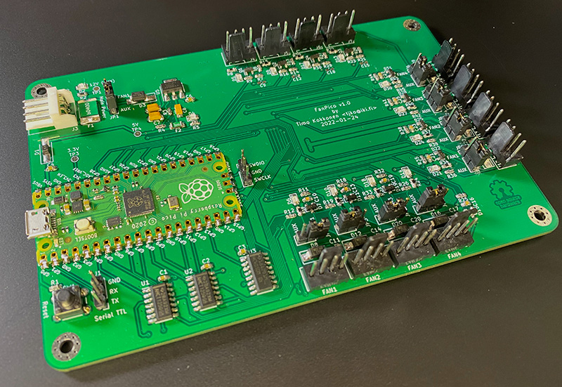
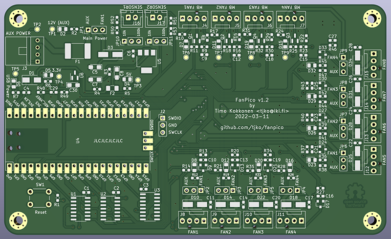

# Fanpico: Smart PWM Fan Controller

Fanpico is a smart PWM (PC) fan controller based around Raspberry Pi Pico (RP2040 MCU).
* Controls up to 8 fans. 
* Connect up to 4 motherboard fan outputs.
* Connect up to 2 remote temperature probes (plus onboard "ambient" temperature sensor).
* Can be powered from motherboard fan outputs or using (AUX) 4-pin floppy connector.
* Ability to define custom fan "curves" for each fan.
* Ability to provide custom tachometer (fan RPM) output singal back to motherboard.
* Control fans from any motherboard PWM signal or from temperature sensors.
* OS Independent, no drivers or software needed.
* Configuration stored on the device itself (in the flash memory).
* SCPI "like" programming interface (see [Command Reference](commands.md))
* Monitor each fan and motherboard output signals as well as temperatures.

## Hardware
Fanpico is Open Source Hardware, reference design is provided for the "0804" model (8 fan outpus and 4 motherboard fan inputs). 
Initially Fanpico will be only a DIY project, but if there is succifient interested then DIY kits may be made available. Since this is Open Hardware, we hope that there will be sellers that eventually offer pre-built units as well as kits....

Additional models with different combinations of fan inputs/outputs could be easily designed (takining into account limitations of Raspberry Pi Pico I/O limits). New and improved PCB models/designs are most welcome.

Photo of the first prototype:

### Hardware Design
Fanpico (reference design) utilizes all available I/O pins on a Raspberry Pi Pico.
* Fan PWM outputs are driven by the Pico's PWM hardware.
* Motherboard Fan PWM inputs are read using Pico's PWM hardware.
* Tacho signal output (for motherboard connectors) is generated using Pico's PIO hardware, providing extremely stable tachometer signal.
* Tacho signal inputs (from fans) is read using GPIO interrupts (counting number of pulses received over a period of time)
* Temperature readings are done using ADC, with help of a accurrate 3V voltage reference (LM4040)
* Each FAN output has jumper to select whether fan gets its power from associated MBFAN connector or from the AUX connector
* There is a jumper to select wheter power the Fanpico itself from MBFAN1 or AUX connector.

### Models (PCB designs)
* [FANPICO-0804](boards/0804/)

Reference PCB was designed with KiCad.

## Firmware
Firmware is developed in C using the Pico SDK.
Plan is to release firmware files (.u2f) after Fanpico is ready for 'release', currently one must compile the firmware from the sources.

### Building Firmware Images

Raspberry Pi Pico C/C++ SDK is required for compiling the firmware: 

#### Requirements
* [Raspberry Pi Pico C/C++ SDK](https://www.raspberrypi.com/documentation/microcontrollers/c_sdk.html)
* [cJSON](https://github.com/DaveGamble/cJSON)
* [pico-littlefs](https://github.com/lurk101/pico-littlefs)

(When building fanpico firmware libraries are expected to be in following locations: ../cJSON/ and ../pico-littlefs/)

