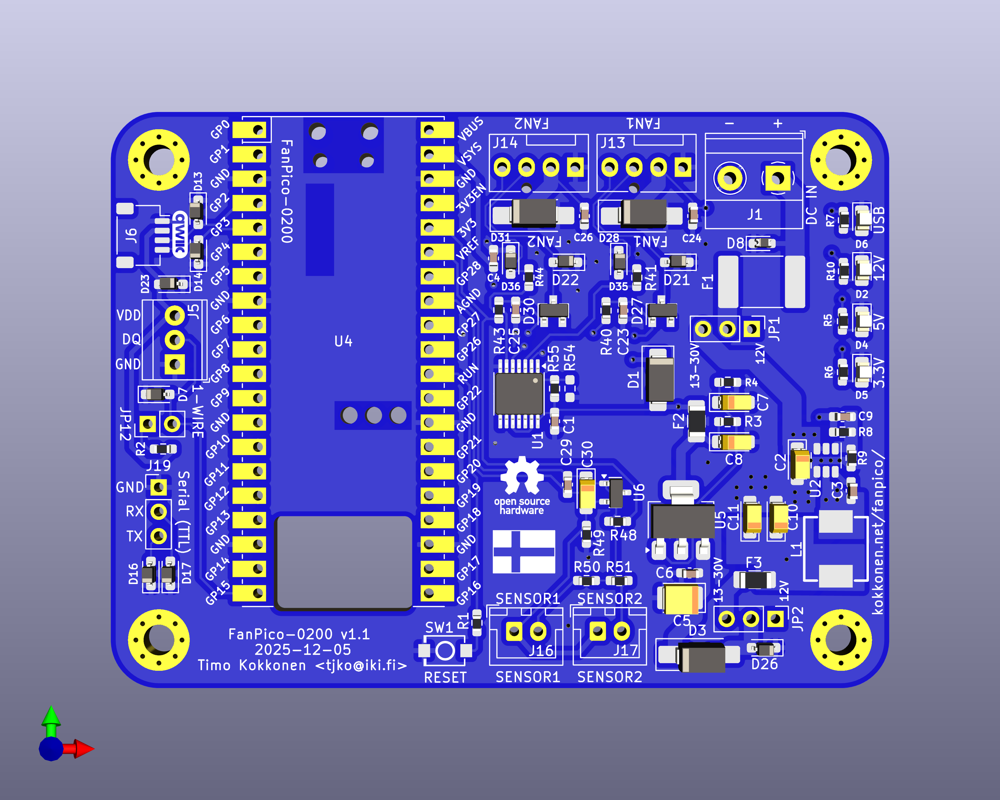

# FANPICO-0200 PCB

PCB Size: 81.0mm x 60.0mm

## Change Log

v1.1
- Add fuse (F3) to prevent pulling too much current through the buck regulator.
- Move sensor connectors footprints (J16 & J17) slightly away from board edge
  to allow better fitment of right angle connectors.

v1.0
- First Prototye

