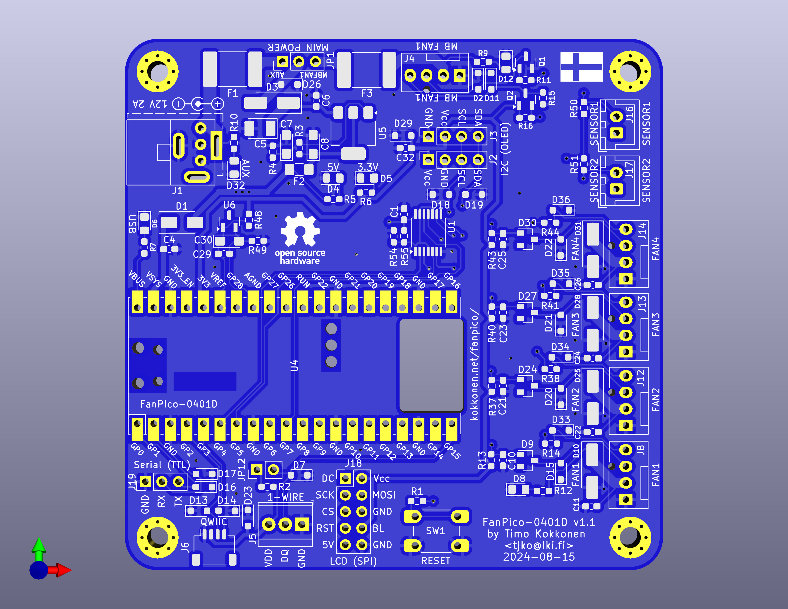

# FANPICO-0401D PCB

PCB Size: 82.5mm x 81.5mm

## Change Log

v1.0
- First Prototye
- Based on 0804D v1.2c
- Combination footprint for AUX power connector (4-Pin Floppy and DC Barrel connector)
- New connectors: QWIIC, 1-Wire
- Errata:
  - R8 resistor had incorrect value, use 0 ohm (instead of originally specified 1k ohm).

