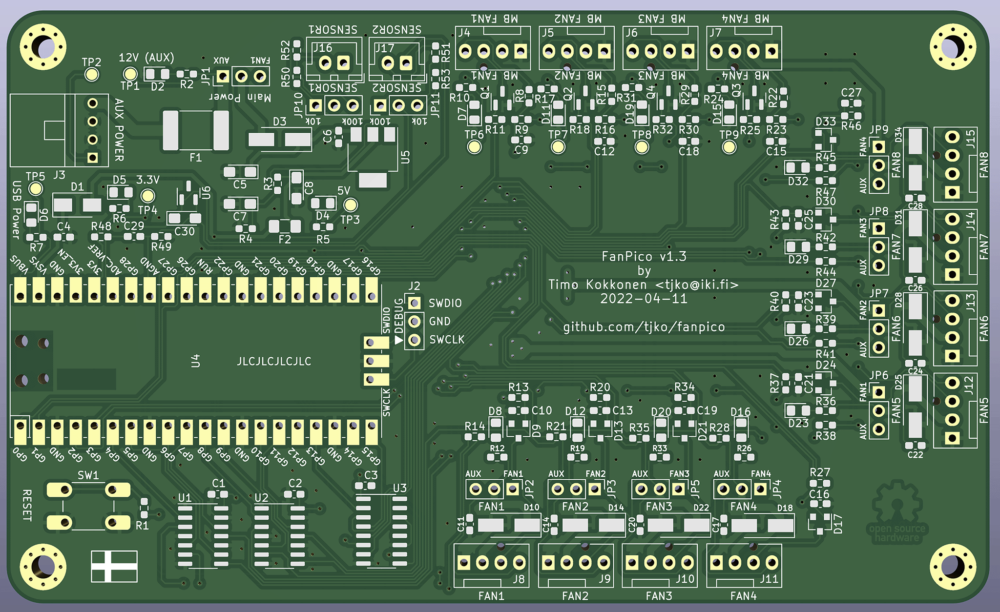

# FANPICO-0804 PCB

PCB Size: 135mm x 81.5mm

## Change Log

v1.3
- Rotate fan and temperature sensor connectors 180 degrees to allow use of right-angle connectors
- Fix silksreen labels for JP11 (SENSOR2)
- Update SW1 pad to support both SMD and through-hole 6mm switches.

v1.2
- Change sensor connectors to JST XH (2.5mm)
- Add jumper to select between 10k / 100k NTC thermistor
- Errata:
  - JP11 (SENSOR2 Thermistor type jumper) silk screen wrong. Workaround is to swap R51 and R53 during assembly.

v1.1
- Add two connectors for Temperature Sensors
- Fixed Floppy Connector pinout
- Remove TTL Serial output

v1.0 
- First Prototye
