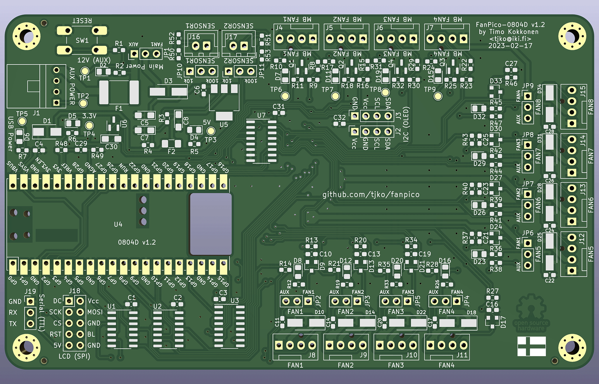

# FANPICO-0804D PCB

PCB Size: 135mm x 81.5mm

## Change Log

v1.2
- Add alternate OLED display header with alternate pinout (J2)
- Change J18 header to 2x5 pins (with extra pins often needed for SPI displays)
- Change pull-ups to pull-downs on PWM signal pins on MBFAN inputs.

v1.1
- Add support for direct mounting either Pico or Pico W
- Remove unused footprints
- Fix errata from v1.0
- Errata:
  - JP11 Silkscreen incorrect: 10K and 100K labels should be the otherway around.

v1.0 
- First Prototye
- Based on 0804 v1.3, with added OLED (I2c) display module support
- Errata:
  - U7 pin 7 (VEE) should be grounded.
    Workaround: add solder bridge between pins 7 & 8.
