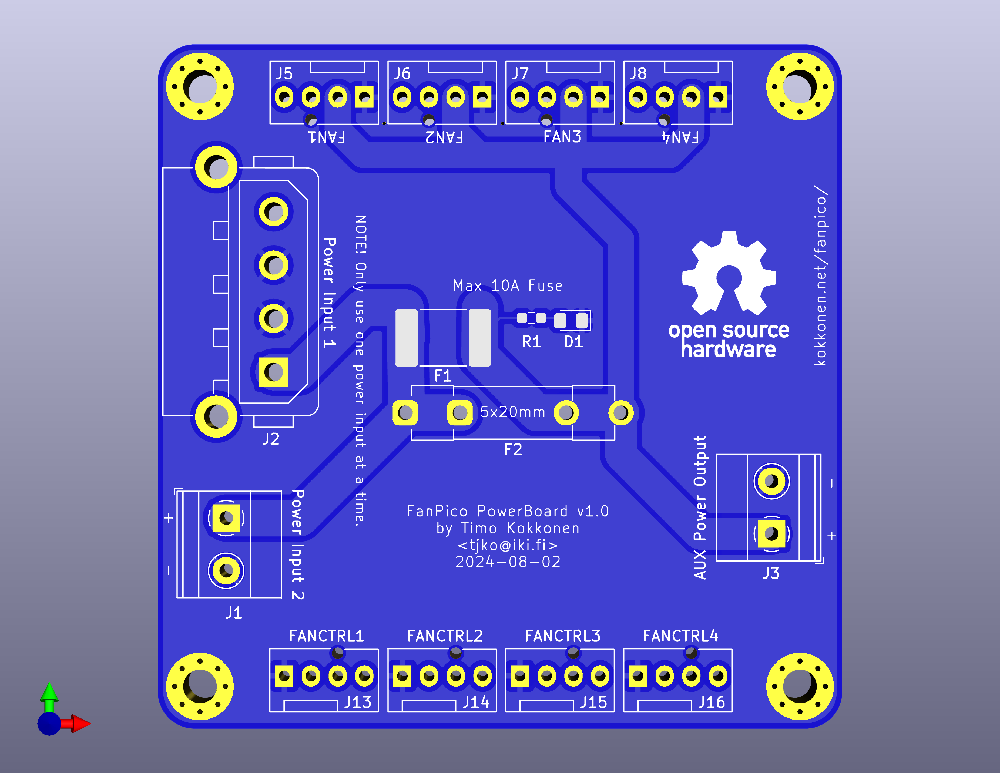

# FanPico-Power-Board

PCB Size: 65mm x 65mm

This is a small power injector board for powering high-power fans, that require
too much current to be connected directly to Fan ports on FanPico boards.

Board is meant to be in between FanPico Fan ports and the high-power fans.
Fan Power Supply (12V) should be connected to one of the power inputs (only on input
should be used at a time). Fans should be connected to "FAN" ports on the board, and
cables connected to FanPico (FAN ports) for fan control/monitoring.
"FANCTRL" ports do not have voltage pin connected so no power is drawn from the fan controller.

Assembly note, install either F1 (poly fuse) or F2 (fuse holder for 5x20mm fuses), not both.

Manufacturing note, should be made with 2oz copper thickness for adequate current carrying capacity.

## Change Log

v1.0 
- Initial revision.

